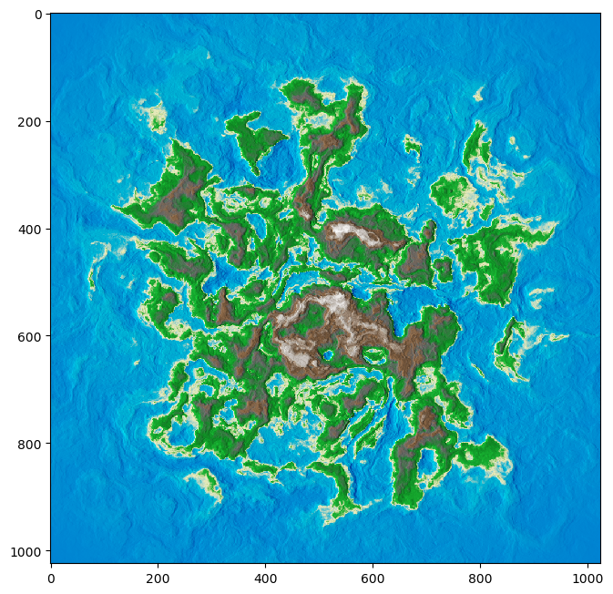

# mapgen



## QuickStart

```bash
pip install -r requirements.txt
python main.py
```

or check out the [notebook](examples.ipynb)

## Todo

 - erosion
    - hydraulic (WIP)
    - thermal
 - rivers
 - city placement
 - biomes
 - techtonics
 - meshing
 - projections
 - climates
 - roads
 - plant growth